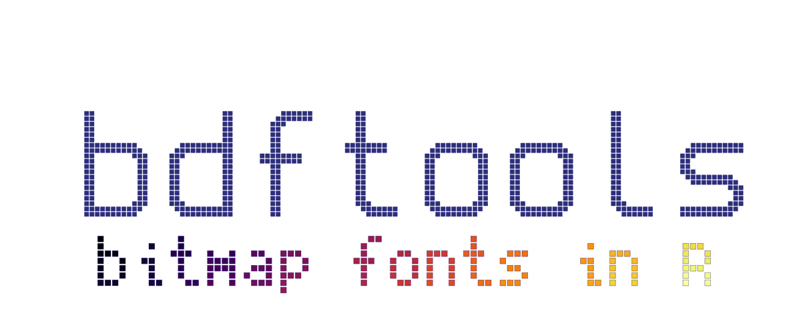

<!-- README.md is generated from README.Rmd. Please edit that file -->

```{r, include = FALSE}
knitr::opts_chunk$set(
  collapse = FALSE,
  comment = "#>",
  fig.path = "man/figures/README-",
  out.width = "100%"
)

library(bdftools)
```


```{r eval=FALSE, include=FALSE}
pkgdown::build_site(override = list(destination = "../coolbutuseless.github.io/package/bdftools"))
```

# bdftools




<!-- badges: start -->

<!-- badges: end -->

`bdftools` provides some tools for reading, manipulating and outputting BDF bitmap fonts.

## ToDo

* Todo: print header info when printing font
    * Number of characters, width, height, bbox etc
    
### What's in the box

* `read_bdf(filename)` reads a BDF pixel font file into an R representation
   i.e. an object of class `bdf`
* `print.bdf()` prints meta information and a font sample. 
* `bdf_create_df(bdf, text)` Create a data.frame of points for the given string 
* `bdf_create_mat(bdf, text)` Create a matrix representation for the given string
* `bdfGrob(bdf, text, ...)` create a simple grob representation of the given string using
   squares for pixels
* `geom_text_bdf()` renders text in a bitmap font - simlar interface to `ggplot2::geom_text()`
* `as.data.frame.bdf(bdf)` converts the full `bdf` font into a rectangular 
   data.frame of all characters and their (x, y) coordinates.
* `read_bdf_builtin()` to read in a font included with this package:
    * [Cozette](https://github.com/slavfox/Cozette) License: MIT. See `LICENSE-cozette`
    * [Creep2](https://github.com/raymond-w-ko/creep2) License: MIT. See `LICENSE-creep2`
    * [Spleen](https://github.com/fcambus/spleen) License: BSD 2-clause. See `LICENSE-spleen`

You can install from [GitHub](https://github.com/coolbutuseless/bdftools) with:

``` r
# install.package('remotes')
remotes::install_github('coolbutuseless/bdftools')
```

## Example: Loading and displaying a BDF bitmap font.

```{r comment='', fig.height = 3}
library(grid)
library(ggplot2)
library(bdftools)

#~~~~~~~~~~~~~~~~~~~~~~~~~~~~~~~~~~~~~~~~~~~~~~~~~~~~~~~~~~~~~~~~~~~~~~~~~~~~~
# Load a BDF font
#~~~~~~~~~~~~~~~~~~~~~~~~~~~~~~~~~~~~~~~~~~~~~~~~~~~~~~~~~~~~~~~~~~~~~~~~~~~~~
fontfile <- system.file("spleen-5x8.bdf", package = "bdftools", mustWork = TRUE)
myfont <- read_bdf(fontfile)

#~~~~~~~~~~~~~~~~~~~~~~~~~~~~~~~~~~~~~~~~~~~~~~~~~~~~~~~~~~~~~~~~~~~~~~~~~~~~~
# By default, printing a font will print some header info, and a text 
# sample rendered in that font in the console
#~~~~~~~~~~~~~~~~~~~~~~~~~~~~~~~~~~~~~~~~~~~~~~~~~~~~~~~~~~~~~~~~~~~~~~~~~~~~~
myfont

#~~~~~~~~~~~~~~~~~~~~~~~~~~~~~~~~~~~~~~~~~~~~~~~~~~~~~~~~~~~~~~~~~~~~~~~~~~~~~
# Generate some sample text in the console
#~~~~~~~~~~~~~~~~~~~~~~~~~~~~~~~~~~~~~~~~~~~~~~~~~~~~~~~~~~~~~~~~~~~~~~~~~~~~~
bdf_print_sample(myfont, "Hello RStats", wrap = FALSE)

#~~~~~~~~~~~~~~~~~~~~~~~~~~~~~~~~~~~~~~~~~~~~~~~~~~~~~~~~~~~~~~~~~~~~~~~~~~~~~
# To compensate for many terminal fonts having a 2:1 ratio, it is possible 
# to customize the characters used for each pixel
#~~~~~~~~~~~~~~~~~~~~~~~~~~~~~~~~~~~~~~~~~~~~~~~~~~~~~~~~~~~~~~~~~~~~~~~~~~~~~
bdf_print_sample(myfont, "Hello RStats", wrap = FALSE, zero = '  ', one = '@@')

bdf_print_sample(myfont, "Hello RStats", wrap = FALSE, zero = '  ', one = '\u2588\u2588')

#~~~~~~~~~~~~~~~~~~~~~~~~~~~~~~~~~~~~~~~~~~~~~~~~~~~~~~~~~~~~~~~~~~~~~~~~~~~~~
# Generate a graphics grob and draw it
#~~~~~~~~~~~~~~~~~~~~~~~~~~~~~~~~~~~~~~~~~~~~~~~~~~~~~~~~~~~~~~~~~~~~~~~~~~~~~
grob <- bdfGrob(myfont, "Hello\nRStats", size = 10, shrink = 0.8, fill = 'lightblue', col = 'blue')
grid.newpage(); grid.draw(grob)


#~~~~~~~~~~~~~~~~~~~~~~~~~~~~~~~~~~~~~~~~~~~~~~~~~~~~~~~~~~~~~~~~~~~~~~~~~~~~~
# View the entire font as a data.frame of coordiantes
#~~~~~~~~~~~~~~~~~~~~~~~~~~~~~~~~~~~~~~~~~~~~~~~~~~~~~~~~~~~~~~~~~~~~~~~~~~~~~
as.data.frame(myfont)

#~~~~~~~~~~~~~~~~~~~~~~~~~~~~~~~~~~~~~~~~~~~~~~~~~~~~~~~~~~~~~~~~~~~~~~~~~~~~~
# View the coordinates of a string rendered in this font
#~~~~~~~~~~~~~~~~~~~~~~~~~~~~~~~~~~~~~~~~~~~~~~~~~~~~~~~~~~~~~~~~~~~~~~~~~~~~~
bdf_create_df(myfont, "abc")

#~~~~~~~~~~~~~~~~~~~~~~~~~~~~~~~~~~~~~~~~~~~~~~~~~~~~~~~~~~~~~~~~~~~~~~~~~~~~~
# View the coordinates of a string rendered in this font
#~~~~~~~~~~~~~~~~~~~~~~~~~~~~~~~~~~~~~~~~~~~~~~~~~~~~~~~~~~~~~~~~~~~~~~~~~~~~~
bdf_create_mat(myfont, "abc")
```

# An example of a larger font

```{r comment=""}
myfont <- bdftools::read_bdf_builtin("spleen-16x32.bdf")
bdf_print_sample(myfont, "Frak")
```


## ggplot2 example with `geom_text_bdf()`

`geom_text_bdf()` works very similar to `geom_text()` but text is rendered from 
a bitmap font as a collection of large square pixels.  Key things to note:

* Can set both an outline `colour` and a `fill` 
* `shrink` argument determines the size of the square pixel.  `shrink = 1` is
   the default. `shrink = 0.9` will make the square pixels smaller and not 
   touching each other.

```{r fig.width = 12, fig.height = 6}
library(ggplot2)
library(bdftools)

fontfile <- system.file("spleen-5x8.bdf", package = "bdftools", mustWork = TRUE)

plot_df <- head(mtcars)
plot_df$car <- rownames(plot_df)
plot_df$cyl <- as.factor(plot_df$cyl)

ggplot(plot_df, aes(mpg, wt)) + 
  geom_point(col = 'red') + 
  geom_text_bdf(
    aes(mpg, wt, label=car, fill = cyl), 
    col          = NA, 
    linewidth    = 0.5,
    bdf_filename = fontfile, 
    shrink       = 1,
    size         = 9,
    hjust        = -0.1
  ) + 
  theme_bw() + 
  scale_fill_brewer(palette = 'Dark2') + 
  labs(title = "geom_text_bdf() - bitmap font rendering in ggplot2")
```


## Font sample sheet

An example of how the data.frame representation of the font can be plotted 
in `ggplot2`.

```{r fig.width = 8, fig.height = 8}
library(ggplot2)
library(bdftools)

myfont <- read_bdf_builtin("cozette.bdf")

plot_df <- as.data.frame(myfont)
plot_df <- plot_df[plot_df$encoding >= 65 & plot_df$encoding <= 124,]

ggplot(plot_df) +
  geom_tile(aes(x, y), width=0.9, height = 0.9, na.rm = TRUE) +
  facet_wrap(~encoding + desc, ncol = 12)+
  theme_void(10) +
  coord_equal()
```


## Package Header

How the header for this page was created.

```{r fig.width=18, fig.height=7}
#~~~~~~~~~~~~~~~~~~~~~~~~~~~~~~~~~~~~~~~~~~~~~~~~~~~~~~~~~~~~~~~~~~~~~~~~~~~~~
# Choose some fonts
#~~~~~~~~~~~~~~~~~~~~~~~~~~~~~~~~~~~~~~~~~~~~~~~~~~~~~~~~~~~~~~~~~~~~~~~~~~~~~
font1 <- bdftools::read_bdf_builtin("spleen-16x32.bdf")
font2 <- bdftools::read_bdf_builtin("spleen-5x8.bdf")

#~~~~~~~~~~~~~~~~~~~~~~~~~~~~~~~~~~~~~~~~~~~~~~~~~~~~~~~~~~~~~~~~~~~~~~~~~~~~~
# Main header
#~~~~~~~~~~~~~~~~~~~~~~~~~~~~~~~~~~~~~~~~~~~~~~~~~~~~~~~~~~~~~~~~~~~~~~~~~~~~~
txt1 <- bdfGrob(
  font1, "bdftools", 
  lwd    = 0.5,
  fill   = '#3D428B',
  col    = 'darkblue',
  size   = 8, 
  shrink = 0.8
)

#~~~~~~~~~~~~~~~~~~~~~~~~~~~~~~~~~~~~~~~~~~~~~~~~~~~~~~~~~~~~~~~~~~~~~~~~~~~~~
# Subtitle
#~~~~~~~~~~~~~~~~~~~~~~~~~~~~~~~~~~~~~~~~~~~~~~~~~~~~~~~~~~~~~~~~~~~~~~~~~~~~~
txt2 <- bdfGrob(
  font2, "bitmap fonts in R", 
  lwd    = 0.5,
  col    = 'darkblue',
  size   = 11, 
  shrink = 0.8,
  fill   = viridisLite::inferno(151),
  y      = unit(0.5, 'npc') - unit(50, 'mm')
)

#~~~~~~~~~~~~~~~~~~~~~~~~~~~~~~~~~~~~~~~~~~~~~~~~~~~~~~~~~~~~~~~~~~~~~~~~~~~~~
# Plot it
#~~~~~~~~~~~~~~~~~~~~~~~~~~~~~~~~~~~~~~~~~~~~~~~~~~~~~~~~~~~~~~~~~~~~~~~~~~~~~
grid.newpage(); 
grid.draw(txt1)
grid.draw(txt2)
```


```{r echo=FALSE, eval=FALSE}
png("man/figures/header.png", width = 1200, height = 500)
grid.newpage(); 
grid.draw(txt1)
grid.draw(txt2)
dev.off()
```


## BDF Bitmap Font Resources

* Fonts
    * [Tom Thumb tiny font](https://robey.lag.net/2010/01/23/tiny-monospace-font.html) (License: Dual licensed
      CC0 or CC-BY 3.0 license.)
    * [github repo of lots of fonts](https://github.com/Tecate/bitmap-fonts) (License: Various/unknown)
    * [unifont](https://www.unifoundry.com/unifont/index.html) a BDF font with glyphs
      for every printable codepoint from `U+0000` to `U+FFFF`.  (License: Dual licensed 
      SIL Open Font License (OFL) version 1.1 and the GNU GPL 2+ with the GNU font embedding exception)
    * [X11 fonts](https://www.cl.cam.ac.uk/~mgk25/ucs-fonts.html) (License: Public Domain)
* BDF Font Specification
    * [BDF on Wikipedia](https://en.wikipedia.org/wiki/Glyph_Bitmap_Distribution_Format)
    * [BDF Specification Document (Adobe)](https://adobe-type-tools.github.io/font-tech-notes/pdfs/5005.BDF_Spec.pdf)

## Related Software

Other retro/vector/pixel fonts in R

* [arcade font](https://github.com/coolbutuseless/arcadefont)
* [gridfont](https://github.com/coolbutuseless/gridfont)
* [hershey](https://github.com/coolbutuseless/hershey)

## Acknowledgements

* R Core for developing and maintaining the language.
* CRAN maintainers, for patiently shepherding packages onto CRAN and maintaining
  the repository
