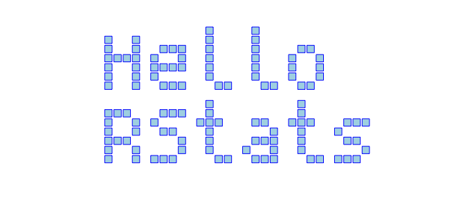
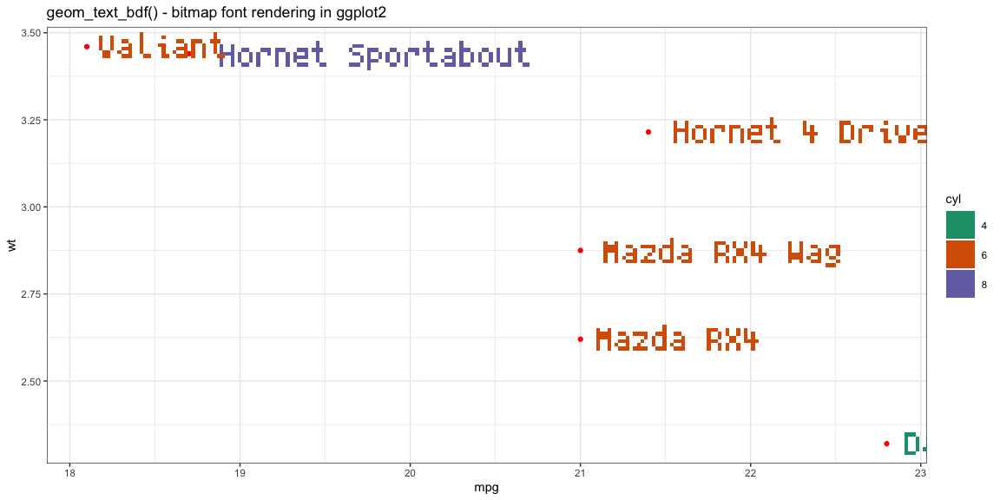
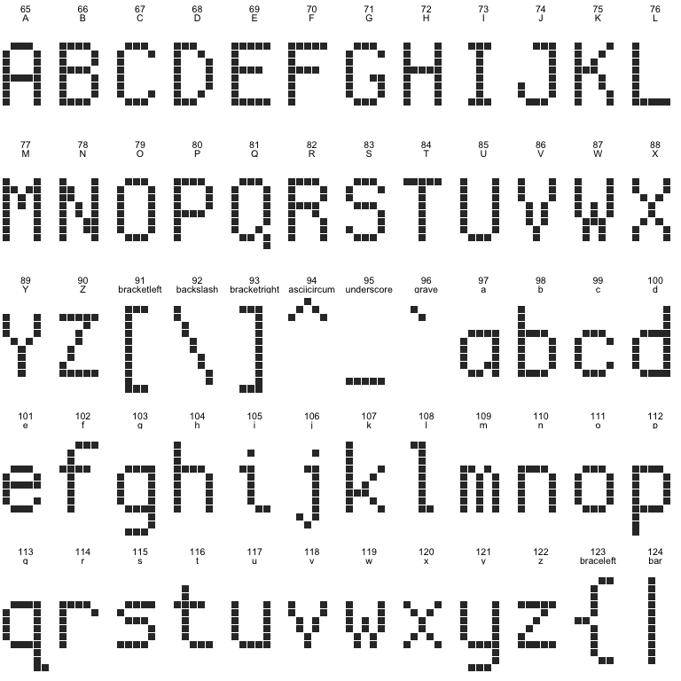
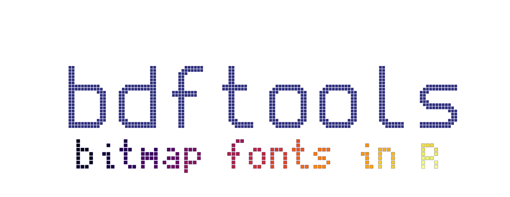

<!-- README.md is generated from README.Rmd. Please edit that file -->

# bdftools


<!-- badges: start -->


<!-- badges: end -->

`bdftools` provides some tools for reading, manipulating and outputting
BDF bitmap fonts.

## ToDo

-   Todo: print header info when printing font
    -   Number of characters, width, height, bbox etc

### What’s in the box

-   `read_bdf(filename)` reads a BDF pixel font file into an R
    representation i.e. an object of class `bdf`
-   `print.bdf()` prints meta information and a font sample.
-   `bdf_create_df(bdf, text)` Create a data.frame of points for the
    given string
-   `bdf_create_mat(bdf, text)` Create a matrix representation for the
    given string
-   `bdfGrob(bdf, text, ...)` create a simple grob representation of the
    given string using squares for pixels
-   `geom_text_bdf()` renders text in a bitmap font - simlar interface
    to `ggplot2::geom_text()`
-   `as.data.frame.bdf(bdf)` converts the full `bdf` font into a
    rectangular data.frame of all characters and their (x, y)
    coordinates.
-   `read_bdf_builtin()` to read in a font included with this package:
    -   [Cozette](https://github.com/slavfox/Cozette) License: MIT. See
        `LICENSE-cozette`
    -   [Creep2](https://github.com/raymond-w-ko/creep2) License: MIT.
        See `LICENSE-creep2`
    -   [Spleen](https://github.com/fcambus/spleen) License: BSD
        2-clause. See `LICENSE-spleen`

You can install from
[GitHub](https://github.com/coolbutuseless/bdftools) with:

``` r
# install.package('remotes')
remotes::install_github('coolbutuseless/bdftools')
```

## Example: Loading and displaying a BDF bitmap font.

``` r
library(grid)
library(ggplot2)
library(bdftools)

#~~~~~~~~~~~~~~~~~~~~~~~~~~~~~~~~~~~~~~~~~~~~~~~~~~~~~~~~~~~~~~~~~~~~~~~~~~~~~
# Load a BDF font
#~~~~~~~~~~~~~~~~~~~~~~~~~~~~~~~~~~~~~~~~~~~~~~~~~~~~~~~~~~~~~~~~~~~~~~~~~~~~~
fontfile <- system.file("spleen-5x8.bdf", package = "bdftools", mustWork = TRUE)
myfont <- read_bdf(fontfile)

#~~~~~~~~~~~~~~~~~~~~~~~~~~~~~~~~~~~~~~~~~~~~~~~~~~~~~~~~~~~~~~~~~~~~~~~~~~~~~
# By default, printing a font will print some header info, and a text 
# sample rendered in that font in the console
#~~~~~~~~~~~~~~~~~~~~~~~~~~~~~~~~~~~~~~~~~~~~~~~~~~~~~~~~~~~~~~~~~~~~~~~~~~~~~
myfont
```

    size=8, bbox=5, pixel_size=8, font_descent=0, font_ascent=-1, default_char=8, line_height=1, bitmap=7, size=32, bbox=8, pixel_size= 

                      #       #                      
    #  #              #       #                      
    #  #  ##  ###   ###  ###  #    ##  #  #  ###  ###
    ####    # #  # #  # #  #  #   #  # #  # #  # #   
    #  #  ### #  # #  # #  #  #   #  # #  # ####  ## 
    #  # #  # #  # #  #  ##   #   #  #  ##  #       #
    #  #  ### #  #  ###    #   ##  ##   ##   ### ### 
                        ###                          

``` r
#~~~~~~~~~~~~~~~~~~~~~~~~~~~~~~~~~~~~~~~~~~~~~~~~~~~~~~~~~~~~~~~~~~~~~~~~~~~~~
# Generate some sample text in the console
#~~~~~~~~~~~~~~~~~~~~~~~~~~~~~~~~~~~~~~~~~~~~~~~~~~~~~~~~~~~~~~~~~~~~~~~~~~~~~
bdf_print_sample(myfont, "Hello RStats", wrap = FALSE)
```

               #    #                        #         #       
    #  #       #    #             ###   ###  #         #       
    #  #  ###  #    #    ##       #  # #    ###   ##  ###   ###
    #### #  #  #    #   #  #      #  #  ##   #      #  #   #   
    #  # ####  #    #   #  #      ###     #  #    ###  #    ## 
    #  # #     #    #   #  #      #  #    #  #   #  #  #      #
    #  #  ###   ##   ##  ##       #  # ###    ##  ###   ## ### 

``` r
#~~~~~~~~~~~~~~~~~~~~~~~~~~~~~~~~~~~~~~~~~~~~~~~~~~~~~~~~~~~~~~~~~~~~~~~~~~~~~
# Generate a graphics grob and draw it
#~~~~~~~~~~~~~~~~~~~~~~~~~~~~~~~~~~~~~~~~~~~~~~~~~~~~~~~~~~~~~~~~~~~~~~~~~~~~~
grob <- bdfGrob(myfont, "Hello\nRStats", size = 10, shrink = 0.8, fill = 'lightblue', col = 'blue')
grid.newpage(); grid.draw(grob)
```



``` r
#~~~~~~~~~~~~~~~~~~~~~~~~~~~~~~~~~~~~~~~~~~~~~~~~~~~~~~~~~~~~~~~~~~~~~~~~~~~~~
# View the entire font as a data.frame of coordiantes
#~~~~~~~~~~~~~~~~~~~~~~~~~~~~~~~~~~~~~~~~~~~~~~~~~~~~~~~~~~~~~~~~~~~~~~~~~~~~~
as.data.frame(myfont)
```

    # A tibble: 2,385 x 10
       encoding desc    dwidth     x     y  size pixel_size font_ascent font_descent
     *    <int> <chr>    <int> <dbl> <dbl> <int>      <int>       <int>        <int>
     1       32 SPACE        5    NA    NA     8          8           7            1
     2       33 EXCLAM…      5     3     7     8          8           7            1
     3       33 EXCLAM…      5     3     6     8          8           7            1
     4       33 EXCLAM…      5     3     5     8          8           7            1
     5       33 EXCLAM…      5     3     4     8          8           7            1
     6       33 EXCLAM…      5     3     3     8          8           7            1
     7       33 EXCLAM…      5     3     1     8          8           7            1
     8       34 QUOTAT…      5     4     7     8          8           7            1
     9       34 QUOTAT…      5     2     7     8          8           7            1
    10       34 QUOTAT…      5     4     6     8          8           7            1
    # … with 2,375 more rows, and 1 more variable: line_height <int>

``` r
#~~~~~~~~~~~~~~~~~~~~~~~~~~~~~~~~~~~~~~~~~~~~~~~~~~~~~~~~~~~~~~~~~~~~~~~~~~~~~
# View the coordinates of a string rendered in this font
#~~~~~~~~~~~~~~~~~~~~~~~~~~~~~~~~~~~~~~~~~~~~~~~~~~~~~~~~~~~~~~~~~~~~~~~~~~~~~
bdf_create_df(myfont, "abc")
```

    # A tibble: 34 x 3
           x     y   idx
       <dbl> <dbl> <int>
     1     3     5     1
     2     2     5     1
     3     4     4     1
     4     4     3     1
     5     3     3     1
     6     2     3     1
     7     4     2     1
     8     1     2     1
     9     4     1     1
    10     3     1     1
    # … with 24 more rows

``` r
#~~~~~~~~~~~~~~~~~~~~~~~~~~~~~~~~~~~~~~~~~~~~~~~~~~~~~~~~~~~~~~~~~~~~~~~~~~~~~
# View the coordinates of a string rendered in this font
#~~~~~~~~~~~~~~~~~~~~~~~~~~~~~~~~~~~~~~~~~~~~~~~~~~~~~~~~~~~~~~~~~~~~~~~~~~~~~
bdf_create_mat(myfont, "abc")
```

         [,1] [,2] [,3] [,4] [,5] [,6] [,7] [,8] [,9] [,10] [,11] [,12] [,13] [,14]
    [1,]    0    0    0    0    0    1    0    0    0     0     0     0     0     0
    [2,]    0    0    0    0    0    1    0    0    0     0     0     0     0     0
    [3,]    0    1    1    0    0    1    1    1    0     0     0     1     1     1
    [4,]    0    0    0    1    0    1    0    0    1     0     1     0     0     0
    [5,]    0    1    1    1    0    1    0    0    1     0     1     0     0     0
    [6,]    1    0    0    1    0    1    0    0    1     0     1     0     0     0
    [7,]    0    1    1    1    0    1    1    1    0     0     0     1     1     1

# An example of a larger font

``` r
myfont <- bdftools::read_bdf_builtin("spleen-16x32.bdf")
bdf_print_sample(myfont, "Frak")
```

        ##########                                     ##         
       ###########                                     ##         
      ###                                              ##         
      ##                                               ##         
      ##                                               ##         
      ##                                               ##         
      ##                ##########     #########       ##     ##  
      ##               ###########     ##########      ##    ###  
      ##              ###       ##             ###     ##   ###   
      #########       ##        ##              ##     ##  ###    
      #########       ##                        ##     ## ###     
      ##              ##                ##########     #####      
      ##              ##               ###########     #####      
      ##              ##              ###       ##     ## ###     
      ##              ##              ##        ##     ##  ###    
      ##              ##              ##        ##     ##   ###   
      ##              ##              ##        ##     ##    ###  
      ##              ##              ###       ##     ##     ### 
      ##              ##               ###########     ##      ###
      ##              ##                ##########     ##       ##

## ggplot2 example with `geom_text_bdf()`

`geom_text_bdf()` works very similar to `geom_text()` but text is
rendered from a bitmap font as a collection of large square pixels. Key
things to note:

-   Can set both an outline `colour` and a `fill`
-   `shrink` argument determines the size of the square pixel.
    `shrink = 1` is the default. `shrink = 0.9` will make the square
    pixels smaller and not touching each other.

``` r
library(ggplot2)
library(bdftools)

fontfile <- system.file("spleen-5x8.bdf", package = "bdftools", mustWork = TRUE)

plot_df <- head(mtcars)
plot_df$car <- rownames(plot_df)
plot_df$cyl <- as.factor(plot_df$cyl)

ggplot(plot_df, aes(mpg, wt)) + 
  geom_point(col = 'red') + 
  geom_text_bdf(
    aes(mpg, wt, label=car, fill = cyl), 
    col          = NA, 
    linewidth    = 0.5,
    bdf_filename = fontfile, 
    shrink       = 1,
    size         = 9,
    hjust        = -0.1
  ) + 
  theme_bw() + 
  scale_fill_brewer(palette = 'Dark2') + 
  labs(title = "geom_text_bdf() - bitmap font rendering in ggplot2")
```



## Font sample sheet

An example of how the data.frame representation of the font can be
plotted in `ggplot2`.

``` r
library(ggplot2)
library(bdftools)

myfont <- read_bdf_builtin("cozette.bdf")

plot_df <- as.data.frame(myfont)
plot_df <- plot_df[plot_df$encoding >= 65 & plot_df$encoding <= 124,]

ggplot(plot_df) +
  geom_tile(aes(x, y), width=0.9, height = 0.9, na.rm = TRUE) +
  facet_wrap(~encoding + desc, ncol = 12)+
  theme_void(10) +
  coord_equal()
```



## Package Header

How the header for this page was created.

``` r
#~~~~~~~~~~~~~~~~~~~~~~~~~~~~~~~~~~~~~~~~~~~~~~~~~~~~~~~~~~~~~~~~~~~~~~~~~~~~~
# Choose some fonts
#~~~~~~~~~~~~~~~~~~~~~~~~~~~~~~~~~~~~~~~~~~~~~~~~~~~~~~~~~~~~~~~~~~~~~~~~~~~~~
font1 <- bdftools::read_bdf_builtin("spleen-16x32.bdf")
font2 <- bdftools::read_bdf_builtin("spleen-5x8.bdf")

#~~~~~~~~~~~~~~~~~~~~~~~~~~~~~~~~~~~~~~~~~~~~~~~~~~~~~~~~~~~~~~~~~~~~~~~~~~~~~
# Main header
#~~~~~~~~~~~~~~~~~~~~~~~~~~~~~~~~~~~~~~~~~~~~~~~~~~~~~~~~~~~~~~~~~~~~~~~~~~~~~
txt1 <- bdfGrob(
  font1, "bdftools", 
  lwd    = 0.5,
  fill   = '#3D428B',
  col    = 'darkblue',
  size   = 8, 
  shrink = 0.8
)

#~~~~~~~~~~~~~~~~~~~~~~~~~~~~~~~~~~~~~~~~~~~~~~~~~~~~~~~~~~~~~~~~~~~~~~~~~~~~~
# Subtitle
#~~~~~~~~~~~~~~~~~~~~~~~~~~~~~~~~~~~~~~~~~~~~~~~~~~~~~~~~~~~~~~~~~~~~~~~~~~~~~
txt2 <- bdfGrob(
  font2, "bitmap fonts in R", 
  lwd    = 0.5,
  col    = 'darkblue',
  size   = 11, 
  shrink = 0.8,
  fill   = viridisLite::inferno(151),
  y      = unit(0.5, 'npc') - unit(50, 'mm')
)

#~~~~~~~~~~~~~~~~~~~~~~~~~~~~~~~~~~~~~~~~~~~~~~~~~~~~~~~~~~~~~~~~~~~~~~~~~~~~~
# Plot it
#~~~~~~~~~~~~~~~~~~~~~~~~~~~~~~~~~~~~~~~~~~~~~~~~~~~~~~~~~~~~~~~~~~~~~~~~~~~~~
grid.newpage(); 
grid.draw(txt1)
grid.draw(txt2)
```



## BDF Bitmap Font Resources

-   Fonts
    -   [Tom Thumb tiny
        font](https://robey.lag.net/2010/01/23/tiny-monospace-font.html)
        (License: Dual licensed CC0 or CC-BY 3.0 license.)
    -   [github repo of lots of
        fonts](https://github.com/Tecate/bitmap-fonts) (License:
        Various/unknown)
    -   [unifont](https://www.unifoundry.com/unifont/index.html) a BDF
        font with glyphs for every printable codepoint from `U+0000` to
        `U+FFFF`. (License: Dual licensed SIL Open Font License (OFL)
        version 1.1 and the GNU GPL 2+ with the GNU font embedding
        exception)
    -   [X11 fonts](https://www.cl.cam.ac.uk/~mgk25/ucs-fonts.html)
        (License: Public Domain)
-   BDF Font Specification
    -   [BDF on
        Wikipedia](https://en.wikipedia.org/wiki/Glyph_Bitmap_Distribution_Format)
    -   [BDF Specification Document
        (Adobe)](https://adobe-type-tools.github.io/font-tech-notes/pdfs/5005.BDF_Spec.pdf)

## Related Software

Other retro/vector/pixel fonts in R

-   [arcade font](https://github.com/coolbutuseless/arcadefont)
-   [gridfont](https://github.com/coolbutuseless/gridfont)
-   [hershey](https://github.com/coolbutuseless/hershey)

## Acknowledgements

-   R Core for developing and maintaining the language.
-   CRAN maintainers, for patiently shepherding packages onto CRAN and
    maintaining the repository
