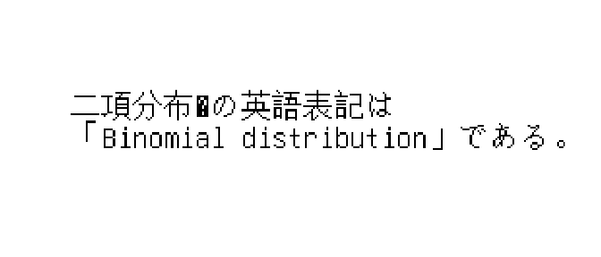
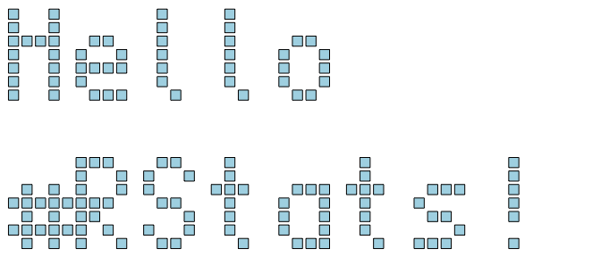
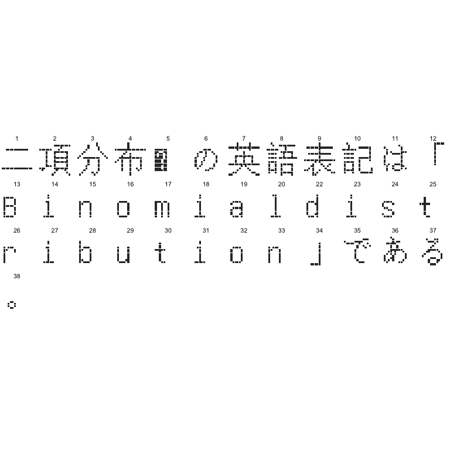
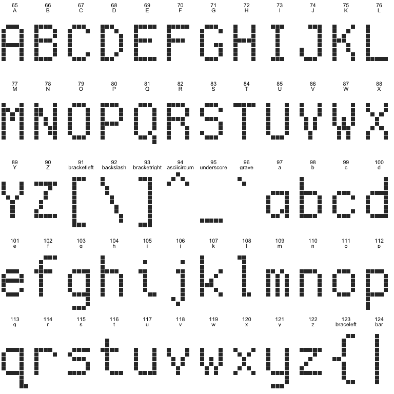

<!-- README.md is generated from README.Rmd. Please edit that file -->

# bdftools

<!-- badges: start -->


<!-- badges: end -->

`bdftools` provides some tools for reading, manipulating and outputting
BDF bitmap fonts.

### What’s in the box

- Bitmap fonts
  - `bitmap_text_coords()` returns a data.frame of pixel locations
  - `bitmap_text_matrix()` returns a binary matrix with pixel locations
    set to 1
  - `bitmap_text_raster()` returns a raster image of the text
- Vector font
  - `vector_text_coords()` returns a data.frame of strokes
  - `vector_text_matrix()` returns a binary matrix with pixel locations
    set to 1
  - `vector_text_raster()` returns a raster image of the text

### Fonts

| Type | Name | Sizes | Unicode? | \# glyphs |
|----|----|----|----|----|
| Bitmap | Cozette | 20x12 ?? | Some | 3536 |
| Bitmap | Creep2 | 11x11 ?? | Some | 508 |
| Bitmap | Spleen | 5x8, 6x12, 8x16, 12x24, 16x32 | Some | 450-1000 |
| Bitmap | Unifont | 16x16 | Yes! | 57086 |
| Vector | gridfont |  | ASCII only |  |
| Vector | gridfont_smooth |  | ASCII only |  |
| Vector | arcade |  | Upper case ASCII only |  |

Bitmap fonts:

- [Cozette v1.25.2](https://github.com/slavfox/Cozette) License: MIT.
  See `LICENSE-cozette.txt`
- [Creep2](https://github.com/raymond-w-ko/creep2) License: MIT. See
  `LICENSE-creep2.txt`
- [Spleen v2.1.0](https://github.com/fcambus/spleen) License: BSD
  2-clause. See `LICENSE-spleen.txt`
- [Unifont](https://unifoundry.com/unifont/) License: SIL Open Font
  License (OFL) version 1.1. See `LICENSE-unifont.txt`

Vector fonts

- [gridfont](https://github.com/inconvergent/gridfont) License: MIT. See
  `LICENSE-gridfont.txt`
- `arcade` is a vector font I created. License: SIL Open Font License
  (OFL) version 1.1. See `LICENSE-arcade.txt`

## Installation

You can install from
[GitHub](https://github.com/coolbutuseless/bdftools) with:

``` r
# install.package('remotes')
remotes::install_github('coolbutuseless/bdftools')
```

## Example: Loading and displaying a BDF bitmap font.

``` r
library(grid)
library(ggplot2)
library(bdftools)

c("cozette_hidpi", "cozette", "creep2-11", "spleen-12x24", "spleen-16x32", 
"spleen-32x64", "spleen-5x8", "spleen-6x12", "spleen-8x16", "unifont")
```

     [1] "cozette_hidpi" "cozette"       "creep2-11"     "spleen-12x24" 
     [5] "spleen-16x32"  "spleen-32x64"  "spleen-5x8"    "spleen-6x12"  
     [9] "spleen-8x16"   "unifont"      

``` r
txt <- "Hello #RStats"
txt <- "привет"
txt <- "二項分布\xF0\x9F\x8E\xB2の英語表記は\n「Binomial distribution」である。"


bitmap_text_raster(txt, "unifont") |> 
  plot(interpolate = FALSE)
```



``` r
coords <- bitmap_text_coords("Hello\n#RStats!", "creep2-11")
head(coords)
```

    # A tibble: 6 × 5
          x     y    x0    y0   idx
      <dbl> <dbl> <int> <int> <int>
    1     4    18     4     7     1
    2     1    18     1     7     1
    3     4    17     4     6     1
    4     1    17     1     6     1
    5     4    16     4     5     1
    6     3    16     3     5     1

``` r
grid.newpage()
grid.rect(coords$x * 4, coords$y * 4, width = 3, height = 3, default.units = 'mm',
          gp = gpar(fill = 'lightblue'))
```



## Bit map font - sample sheet

An example of how the data.frame representation of the font can be
plotted in `ggplot2`.

``` r
library(ggplot2)
library(bdftools)

txt <- "привет"
txt <- "二項分布\xF0\x9F\x8E\xB2の英語表記は「Binomial distribution」である。"
txt <- "a b c"
plot_df <- bitmap_text_coords(paste(txt, collapse = ""), "unifont")
plot_df <- bitmap_text_coords(paste(txt, collapse = ""), "spleen-32x64")
plot_df <- bitmap_text_coords(paste(txt, collapse = ""), "spleen-32x64")

# plot_df <- as.data.frame(bdftools:::bdfs$cozette)
# plot_df <- plot_df[plot_df$encoding >= utf8ToInt('A') & plot_df$encoding <= utf8ToInt('|'),]

ggplot(plot_df) +
  geom_tile(aes(x0, y0), width=0.9, height = 0.9, na.rm = TRUE) +
  facet_wrap(~idx, ncol = 12)+
  theme_void(10) +
  coord_equal()
```



## Vector Font

``` r
df <- vector_text_coords('Hello', font = 'gridfont')
df
```

    #>    char_idx char stroke  x y idx width height xoffset line
    #> 1         1    h      1  0 6   1     4      9       0    1
    #> 2         1    h      1  0 0   2     4      9       0    1
    #> 3         1    h      2  0 3   1     4      9       0    1
    #> 4         1    h      2  1 4   2     4      9       0    1
    #> 5         1    h      2  2 4   3     4      9       0    1
    #> 6         1    h      2  3 3   4     4      9       0    1
    #> 7         1    h      2  3 0   5     4      9       0    1
    #> 8         2    e      1  5 2   1     4      9       4    1
    #> 9         2    e      1  6 2   2     4      9       4    1
    #> 10        2    e      1  7 3   3     4      9       4    1
    #> 11        2    e      1  6 4   4     4      9       4    1
    #> 12        2    e      1  5 4   5     4      9       4    1
    #> 13        2    e      1  4 3   6     4      9       4    1
    #> 14        2    e      1  4 1   7     4      9       4    1
    #> 15        2    e      1  5 0   8     4      9       4    1
    #> 16        2    e      1  6 0   9     4      9       4    1
    #> 17        2    e      1  7 1  10     4      9       4    1
    #> 18        3    l      1  8 6   1     1      9       8    1
    #> 19        3    l      1  8 0   2     1      9       8    1
    #> 20        4    l      1  9 6   1     1      9       9    1
    #> 21        4    l      1  9 0   2     1      9       9    1
    #> 22        5    o      1 13 3   1     4      9      10    1
    #> 23        5    o      1 12 4   2     4      9      10    1
    #> 24        5    o      1 11 4   3     4      9      10    1
    #> 25        5    o      1 10 3   4     4      9      10    1
    #> 26        5    o      1 10 1   5     4      9      10    1
    #> 27        5    o      1 11 0   6     4      9      10    1
    #> 28        5    o      1 12 0   7     4      9      10    1
    #> 29        5    o      1 13 1   8     4      9      10    1
    #> 30        5    o      1 13 3   9     4      9      10    1

``` r
vector_text_matrix('Hello', font = 'gridfont', scale = 1)
```

    #>      [,1] [,2] [,3] [,4] [,5] [,6] [,7] [,8] [,9] [,10] [,11] [,12] [,13] [,14]
    #> [1,]    1    0    0    0    0    0    0    0    0     0     1     0     1     0
    #> [2,]    1    0    0    0    0    0    0    0    0     0     1     0     1     0
    #> [3,]    1    1    1    0    0    0    1    1    0     0     1     0     1     0
    #> [4,]    1    0    0    1    0    1    0    0    1     0     1     0     1     0
    #> [5,]    1    0    0    1    0    1    1    1    0     0     1     0     1     0
    #> [6,]    1    0    0    1    0    1    0    0    1     0     1     0     1     0
    #> [7,]    1    0    0    1    0    0    1    1    0     0     1     0     1     0
    #>      [,15] [,16] [,17] [,18]
    #> [1,]     0     0     0     0
    #> [2,]     0     0     0     0
    #> [3,]     0     1     1     0
    #> [4,]     1     0     0     1
    #> [5,]     1     0     0     1
    #> [6,]     1     0     0     1
    #> [7,]     0     1     1     0

``` r
ras <- vector_text_raster('Hello', font = 'gridfont', scale = 10)
plot(ras, interpolate = FALSE)
```



## BDF Bitmap Font Resources

- Fonts
  - [Tom Thumb tiny
    font](https://robey.lag.net/2010/01/23/tiny-monospace-font.html)
    (License: Dual licensed CC0 or CC-BY 3.0 license.)
  - [github repo of lots of
    fonts](https://github.com/Tecate/bitmap-fonts) (License:
    Various/unknown)
  - [unifont](https://www.unifoundry.com/unifont/index.html) a BDF font
    with glyphs for every printable codepoint from `U+0000` to `U+FFFF`.
    (License: Dual licensed SIL Open Font License (OFL) version 1.1 and
    the GNU GPL 2+ with the GNU font embedding exception)
  - [X11 fonts](https://www.cl.cam.ac.uk/~mgk25/ucs-fonts.html)
    (License: Public Domain)
- BDF Font Specification
  - [BDF on
    Wikipedia](https://en.wikipedia.org/wiki/Glyph_Bitmap_Distribution_Format)
  - [BDF Specification Document
    (Adobe)](https://adobe-type-tools.github.io/font-tech-notes/pdfs/5005.BDF_Spec.pdf)

## Related Software

Other retro/vector/pixel fonts in R

- [arcade font](https://github.com/coolbutuseless/arcadefont)
- [gridfont](https://github.com/coolbutuseless/gridfont)
- [hershey](https://github.com/coolbutuseless/hershey)
