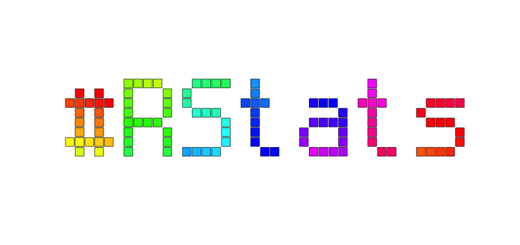

```{r, include = FALSE}
knitr::opts_chunk$set(
  collapse = TRUE,
  comment = "#>"
)
```

```{r setup}
library(bdftools)
```


```{r eval=FALSE}
#~~~~~~~~~~~~~~~~~~~~~~~~~~~~~~~~~~~~~~~~~~~~~~~~~~~~~~~~~~~~~~~~~~~~~~~~~~~~~
# Read on of the fonts included with 'bdftools'
#~~~~~~~~~~~~~~~~~~~~~~~~~~~~~~~~~~~~~~~~~~~~~~~~~~~~~~~~~~~~~~~~~~~~~~~~~~~~~
myfont <- bdftools::read_bdf_builtin(font = 'spleen-6x12.bdf')

#~~~~~~~~~~~~~~~~~~~~~~~~~~~~~~~~~~~~~~~~~~~~~~~~~~~~~~~~~~~~~~~~~~~~~~~~~~~~~
# Helper function to rotate a vector 
#~~~~~~~~~~~~~~~~~~~~~~~~~~~~~~~~~~~~~~~~~~~~~~~~~~~~~~~~~~~~~~~~~~~~~~~~~~~~~
rotate <- function(x, N) {
  c(x[-seq(N)], x[seq(N)])
}

#~~~~~~~~~~~~~~~~~~~~~~~~~~~~~~~~~~~~~~~~~~~~~~~~~~~~~~~~~~~~~~~~~~~~~~~~~~~~~
# Rainbox colours!
#~~~~~~~~~~~~~~~~~~~~~~~~~~~~~~~~~~~~~~~~~~~~~~~~~~~~~~~~~~~~~~~~~~~~~~~~~~~~~
fill <- rainbow(100)

#~~~~~~~~~~~~~~~~~~~~~~~~~~~~~~~~~~~~~~~~~~~~~~~~~~~~~~~~~~~~~~~~~~~~~~~~~~~~~
# Animate the colour-cycling
#~~~~~~~~~~~~~~~~~~~~~~~~~~~~~~~~~~~~~~~~~~~~~~~~~~~~~~~~~~~~~~~~~~~~~~~~~~~~~
for (i in seq.int(1, 500, 10)) {
  
  grob <- bdfGrob(
    myfont, 
    "#RStats",
    size   = 16,
    shrink = 0.9,
    fill   = fill
  )
  
  filename <- sprintf("working/anim/%03i.png", i)
  png(filename, width = 850, height = 400)
  grid.newpage(); grid.draw(grob)
  dev.off()
  
  fill <- rotate(fill, 10)
}

system("convert -delay 10 ./working/anim/*.png vignettes/anim/rainbow.gif")
```





